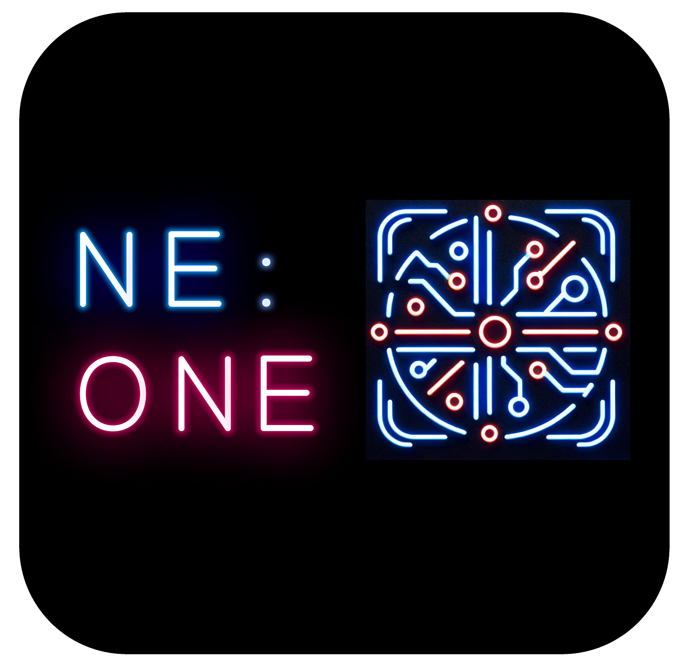

<p align="center">
<br/>
✨ NE:ONE automate ✨
</p>


## ne-one server

| Service | Port | Admin UI / Base URL |
| --- | --- | --- |
| ne-one | 8080 | http://localhost:8080/ |
| graph-db | 7200 | http://localhost:7200/ |
| keycloak | 8089 | http://localhost:8089/ |

### Start ne-one server minimal setup

```bash
cd ne-one-server
docker-compose up -d
```

### OIDC Credentials

| Variable | Value |
| --- | --- |
| Client ID | ne-one-client |
| Client Secret | lx7ThS5aYggdsMm42BP3wMrVqKm9WpNY |
| Token endpoint url | http://localhost:8089/realms/neone/protocol/openid-connect/token |

## ne-one automate backend (based on FastAPI)

```bash
cd backend/app 
docker compose up -d
uvicorn main:app --host 0.0.0.0 --port 80 --reload
```

- FastAPI backend available at  http://localhost:80/
- MongoDB available at http://localhost:27017


## ne-one automate frontend (based on Next.js)

```bash
cd frontend
npm install
npm run dev
```

- Next.js Frontend available at http://localhost:3000
